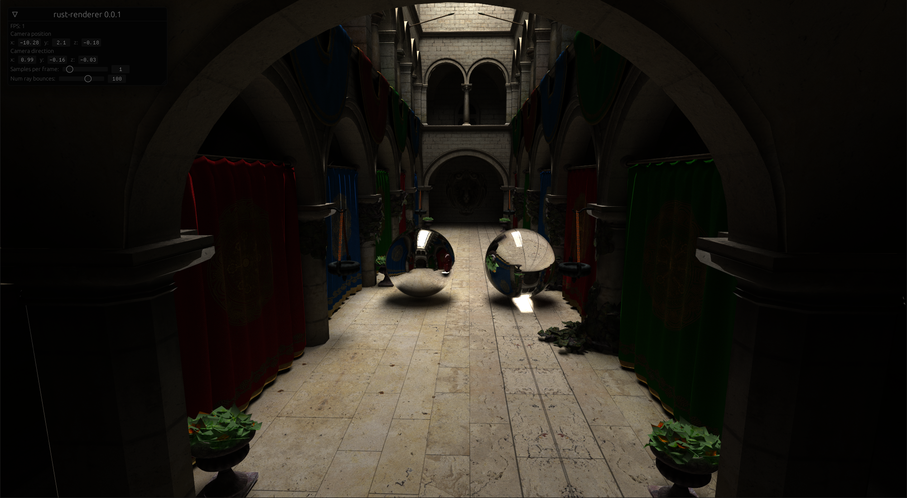
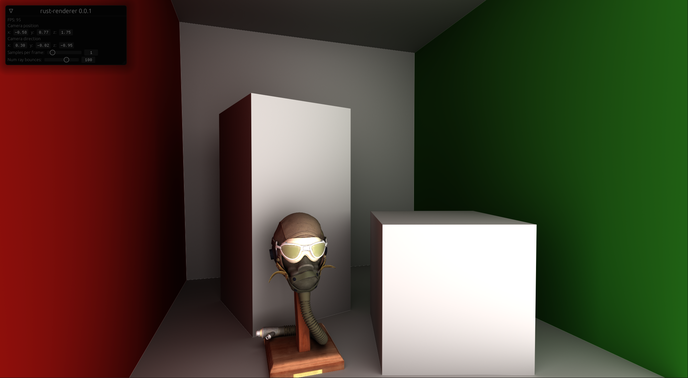

# rust-renderer (placeholder)

Developed to learn Rust and to have a framework for experimenting with modern rendering techniques

## Features
+ Path tracer based on [Ray Tracing in One Weekend](https://raytracing.github.io/books/RayTracingInOneWeekend.html)
+ Basic PBR rendering
+ Bindless GPU resources
+ Experimental high level render graph
+ Vulkan using [ash](https://github.com/MaikKlein/ash)
+ Shader reflection
+ Live shader recompilation

## Building

You need [Rust](https://www.rust-lang.org/tools/install) for building

Build and run the project with `cargo run --release`

**Note**: requires a GPU with raytracing support, e.g Nvidia RTX series

**Note**: only tested on Windows

## Controls

- `SPACE` - toggle between path tracing and rasterization
- `W/A/S/D` - move the camera
- `MOUSE + RMB` - rotate the camera
